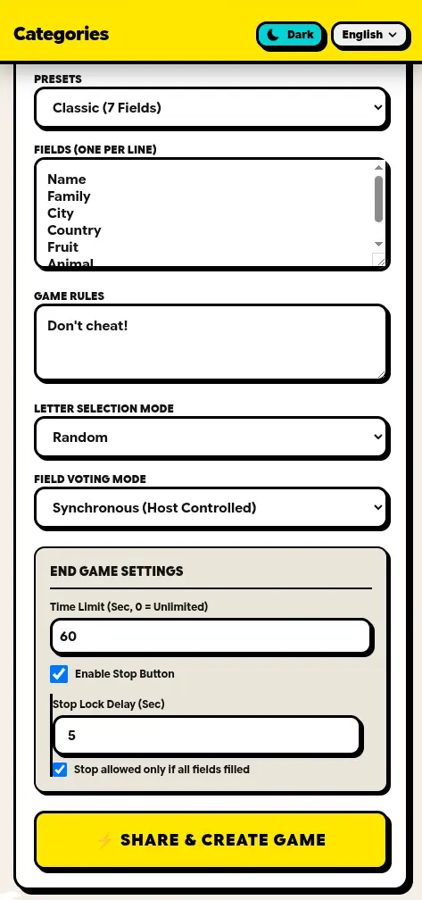

# Categories

**Categories** (اسم‌فامیل — "Name-Family" in Persian) is a [webxdc](https://webxdc.org) app that runs inside **Delta Chat**, providing an online multiplayer word game: players fill in categories (a name, a family name, a city, ...) starting with the round's letter, then judge each other's answers to score points.

## Screenshot



## Features

- **Lobby & ready system** - Join the lobby, mark yourself ready, and the host starts the round once everyone is ready
- **Creator mode** - Configure the fields (classic 7 / advanced 10 / custom), rules, letter selection (random or in-turn), time limit, and the stop button with its delay lock
- **Answer & judging** - Write answers per field, then judge them as correct/wrong — either synchronously (host controlled) or independently per player
- **Scoreboard** - Per-round and cumulative scores, with a per-player answer inspector
- **Vote kick** - Players can vote to exclude someone from the round (50%+ of the other players)
- **Mid-game joiners** - Players who join mid-round see a waiting screen and enter the lobby when the round ends
- **Multi-language support** - All UI text is managed through i18n files

## Development

The app is plain HTML/CSS/JS with no build step. Open `index.html` directly in a browser to develop — `main.js` includes a fallback mock of the webxdc API so everything works outside Delta Chat (updates are echoed back locally instead of being sent over a chat).

To test real chat integration, package the folder as a `.xdc` (zip) file and share it in a Delta Chat chat:

```bash
./temp/make-xdc.sh   # produces temp/app.xdc
```

### Adding a language

Add a new dictionary entry in `i18n.js` (copy the `en` block and translate the strings).
